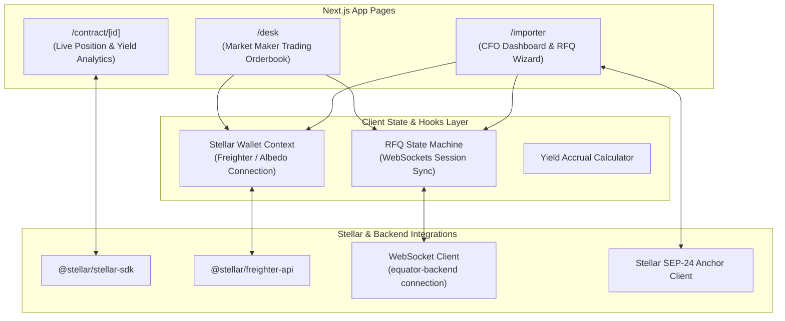

# Equator Finance: Web Application (`equator-frontend`)

> **What is Equator Finance?**  
> Equator Finance is a decentralized B2B FX Forward Protocol built on Stellar (Soroban) for emerging markets. It allows corporate importers and OTC liquidity desks to trustlessly lock in future exchange rates using USDC-settled Non-Deliverable Forwards (NDFs), while routing idle collateral into decentralized yield venues to significantly offset hedging costs.
>
> **Role of this repository:** This repository houses the front-end user interface, providing a clean CFO portal for corporate importers to hedge FX risk and a professional trading terminal for OTC desks to quote rates.

📖 **Central Protocol Overview:** For the master architecture, protocol vision, and multi-repo roadmap, see the [Equator Finance Master Readme](https://github.com/Equator-Finance/.github).

---

## 🎯 Repository Scope & Overview

`equator-frontend` delivers an institutional-grade web application tailored for two distinct user personas:
1. **Corporate Importers (CFO Portal):** A clean financial dashboard to create RFQs, view active FX hedges, and monitor margin safety.
2. **OTC Market Makers (Desk Terminal):** A professional trading interface to view incoming RFQ flows, quote rates, and manage collateral portfolios.

### Tech Stack:
* **Framework:** Next.js (React 18+, App Router)
* **Language:** TypeScript
* **Styling & Components:** **Tailwind CSS**, **Shadcn UI** (Radix Primitives)
* **Wallet Connection:** `@stellar/freighter-api`, Albedo SDK, WalletConnect
* **Stellar Integration:** `@stellar/stellar-sdk`
* **Icons & Charts:** Lucide Icons, Recharts

---

## 🏗 Frontend Architecture

The web application is structured around dual persona portals sharing a unified Stellar wallet and WebSockets connection layer.



---

## 🛠 Project Structure (Target)

```text
equator-frontend/
├── src/
│   ├── components/
│   │   ├── importer/    # RFQ wizard, hedge portfolio, health indicators
│   │   ├── desk/        # Orderbook terminal, rate quote form, desk analytics
│   │   ├── wallet/      # Freighter, Albedo, & WalletConnect connectors
│   │   └── common/      # Tailwind & Shadcn UI design system components
│   ├── pages/ (or app/) # Next.js route pages
│   └── lib/stellar/     # Soroban SDK wrappers & transaction builders
├── public/              # Static assets & brand media
└── README.md
```

---

## 🚀 Development Phases

### Phase 1: CFO Portal & OTC Trading Terminal
* **Goal:** Deliver an intuitive UI for negotiating RFQs, connecting wallets, and managing USDC escrow contracts.
* **Key Tasks & Deliverables:**
  * **Wallet Integration:** Integrate `@stellar/freighter-api` and `@stellar/stellar-sdk` for seamless transaction signing.
  * **Importer RFQ Wizard:** Interactive form for CFOs to select currency pairs (e.g., NGN/USD), notional amount, and maturity duration (30/60/90 days).
  * **OTC Desk Terminal:** Orderbook UI for desks to view open RFQs, set forward rates, and approve margin locking.
  * **Active Hedge Dashboard:** Real-time summary displaying locked margin, contract status, strike rate, and settlement countdown.

### Phase 2: Yield & Risk Analytics Dashboard
* **Goal:** Visualize the financial benefits of yield rehypothecation and position safety.
* **Key Tasks & Deliverables:**
  * **Yield Accrual Widget:** Display real-time interest earned on escrowed USDC via integrated yield venues, showing effective cost reduction.
  * **Margin Health Barometer:** Visual indicators showing collateral health, variation margin requirements, and liquidation alert banners.
  * **Oracle Feed Charts:** Historical vs. live exchange rate charts integrated into the trading view.

### Phase 3: Fiat Anchor Integration & Institutional Suite
* **Goal:** Enable direct local bank account integration and multi-user corporate controls.
* **Key Tasks & Deliverables:**
  * **SEP-24/SEP-31 Anchor Widget:** Embedded modal connecting to Stellar anchors (e.g. Yellow Card, MoneyGram) for direct bank-to-USDC funding.
  * **Multi-User Corporate Governance:** Team role management (Initiator, Approver, Treasury Officer) for corporate CFO workflows.
  * **Audit & Tax Export:** One-click CSV/PDF export of settled hedges for corporate accounting and tax reporting.
